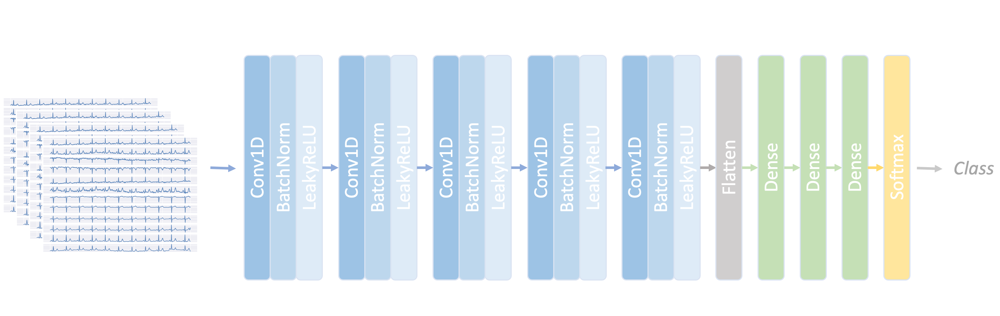
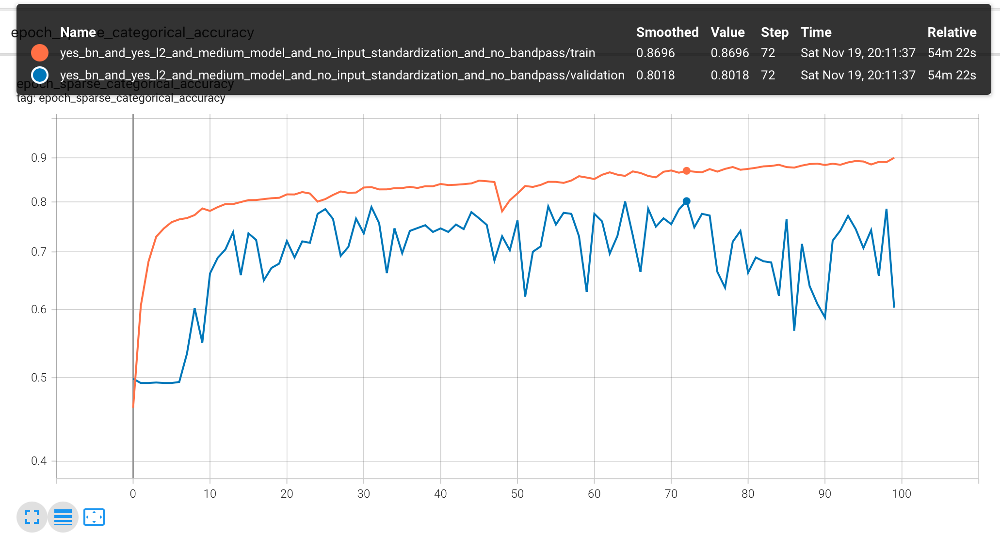
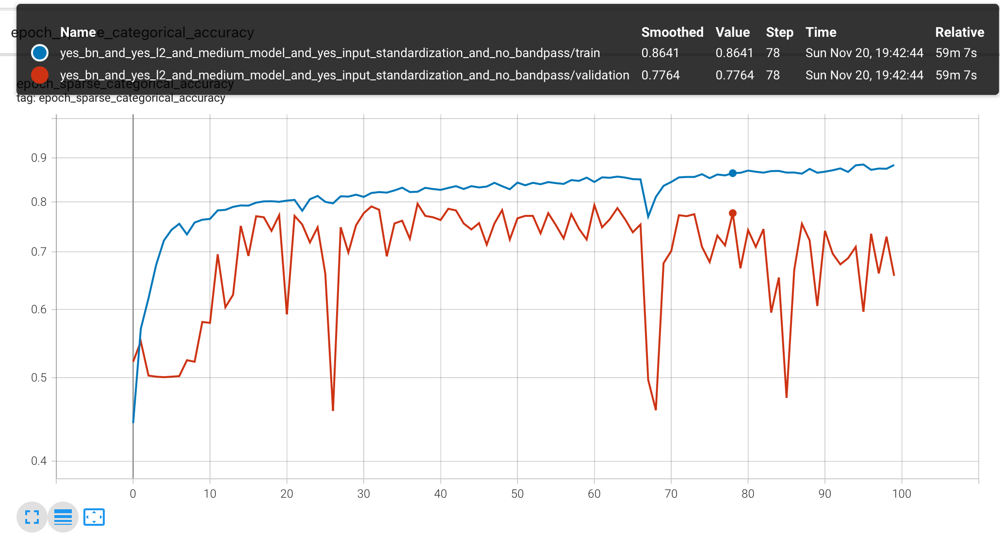
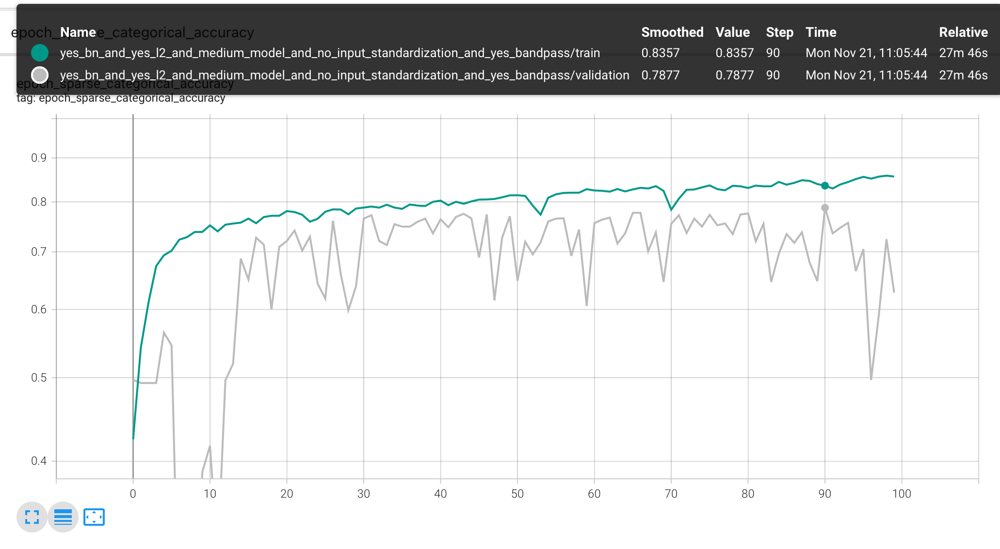
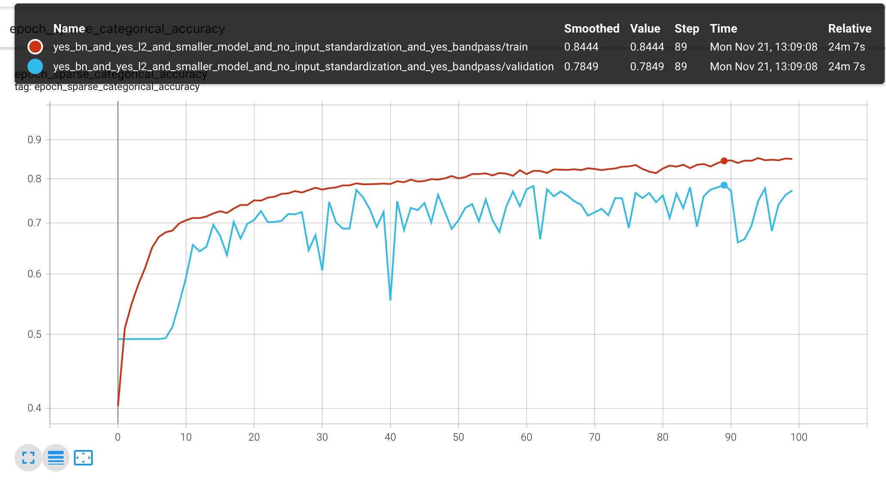
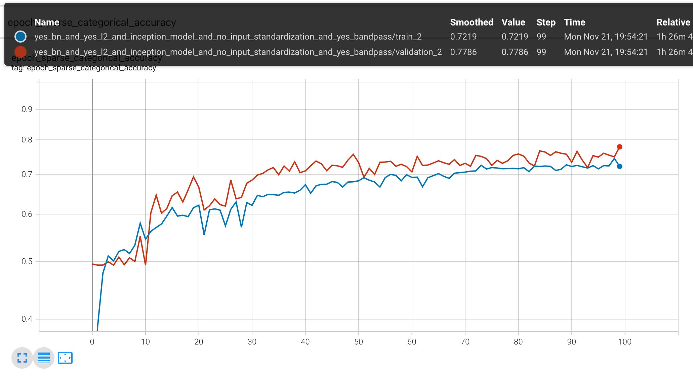
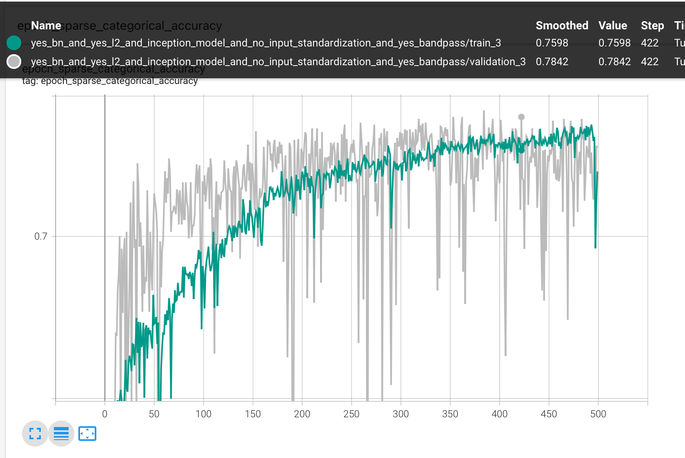

# Idoven Data Scientist Challenge - Proposed solution with explanations and references

## Task #1: Read the ECG files and plot the signal in appropriate manner to be read by a doctor
_Ref. Kligfield, Paul, et al. "Recommendations for the standardization and interpretation of the electrocardiogram: part I: the electrocardiogram and its technology a scientific statement from the American Heart Association Electrocardiography and Arrhythmias Committee, Council on Clinical Cardiology; the American College of Cardiology Foundation; and the Heart Rhythm Society endorsed by the International Society for Computerized Electrocardiology." Journal of the American College of Cardiology 49.10 (2007): 1109-1127._
_Ref. https://ecgwaves.com/topic/12-lead-ecg-cabrera-format-inverting-lead-avr/_

The most commonly used output format for ECG representation involves lead separation based on rows and columns. For standard-sized paper, at 25 mm/s recording speed, four 2.5-second columns can be presented sequentially on the page, with no time disruption between different columns. Each column therefore represents successive 2.5-second intervals of a continuous 10-second record. In the most traditional simultaneous lead format, the first column records rows representing simultaneous leads I, II, and III; the second column records rows representing simultaneous aVR, aVL, and aVF; the third column represents simultaneous leads V1, V2, and V3; the fourth column represents simultaneous leads V4, V5, and V6. 
Additional rows may be available for 1, 2, or 3 leads of 10-second continuous recordings for rhythm analysis. The most used leads for rhythm strip are lead II or V1.

_Task solution: [here](load-and-plot-example-data.ipynb)_

## Task #2: Identify the heartbeat of the signal, average and total heartrate in the signal
_Ref. Pan, Jiapu, and Willis J. Tompkins. "A real-time QRS detection algorithm." IEEE transactions on biomedical engineering 3 (1985): 230-236._

Beat detection is one of the basic tasks done in ECG processing pipelines. This task consists in finding the timepoint at which a new beat occurs, and from the series of consecutive heart beats detected over an ECG signal, the time interval between subsequent beats can give us information on the mean heart rate and heart rhythm.
The most estabilished and used algorithm for beat detection is the Pan-Tompkins algorithm (1985) which applies a series of filters to the ECG to highlight the high frequency content of the signal (characteristic for the QRS complex), so that the identification of such complex is easier. Last step is the application of an adaptive threshold to find the peaks of the signal (the R peaks).
Nowadays, a lot of different methods for beat detection are available, which can be based on filtering the signal, applying Wavelet-Transformation methods, or more complex machine-learning approaches.
Given the availability of different algorithms online, I made use of different open-source packages available on github for this task:

- https://github.com/berndporr/py-ecg-detectors.git

This repo is a collection of 8 ECG heartbeat detection algorithms implemented in Python. For each method, a reference is provided in the README file inside the repo. 
I applied all these detectors for all the 12 channels of the ECGs. Then, I implemented a very basic post-processing of these results to cluster very close annotations from the different detectors together, filter out clusters made of fewer points, and returning the index at which the signal has maximum amplitude as the representative point for the cluster. In this way, ideally, each cluster should represent a QRS complex inside the signal, and the representative point should be located in correspondance of the R peak.
This procedure is intended to merge different results for a single lead of the ECG. 
More complex post-processing should be considered to obtain better performances (most of the implementation was done empirically). Furthermore, one could take into account the different results from the various lead. Some similar approaches are also described in https://www.ncbi.nlm.nih.gov/pmc/articles/PMC7711844/pdf/entropy-22-01302.pdf

- https://github.com/neuropsychology/NeuroKit

NeuroKit2 is a user-friendly package providing easy access to advanced biosignal processing routines. Among the different features for ECG analysis, also beat detection is provided.
QRS complexes are detected based on the steepness of the absolute gradient of the ECG signal. Subsequently, R-peaks are detected as local maxima in the QRS complexes. More details here: https://github.com/neuropsychology/NeuroKit/issues/476
This library gives the best results without any post-processing required. Hence it can be a good solution to annotate the beats in the ECG signal when no annotation is available.

- wfdb functions: https://wfdb.readthedocs.io/en/latest/processing.html#module-3

I also ran wfdb.processing.gqrs_detect() and wfdb.processing.xqrs_detect() on the signals. Among the two, XQRS seemed more robust but still less performant than neurokit.

_Task solution: [here](load-and-plot-example-data.ipynb)_

## Task #3: Identify the complex QRS in the signal and been able to annotate on it
_Ref: https://ecgwaves.com/topic/ecg-normal-p-wave-qrs-complex-st-segment-t-wave-j-point/_

ECG interpretation requires a structured assessment of the morphology of the waves and intervals of the ECG curves. Examples include: P wave duration, PR interval, QRS complex duration, ST segment elevation/depression, QT interval (QTc Corrected interval, standardized for HR).

For this task, I made use of NeuroKit2 package, simply calling the function that performs delineation and plotting the results. 

_Task solution: [here](load-and-plot-example-data.ipynb)_

## Task #4: Exploratory Data Analysis on the PTB-XL Dataset
_Ref. Wagner, P., Strodthoff, N., Bousseljot, R., Samek, W., & Schaeffter, T. (2022). PTB-XL, a large publicly available electrocardiography dataset (version 1.0.3). PhysioNet. https://doi.org/10.13026/kfzx-aw45._
_Ref. Wagner, P., Strodthoff, N., Bousseljot, R.-D., Kreiseler, D., Lunze, F.I., Samek, W., Schaeffter, T. (2020), PTB-XL: A Large Publicly Available ECG Dataset. Scientific Data. https://doi.org/10.1038/s41597-020-0495-6_
_Ref. Goldberger, A., Amaral, L., Glass, L., Hausdorff, J., Ivanov, P. C., Mark, R., ... & Stanley, H. E. (2000). PhysioBank, PhysioToolkit, and PhysioNet: Components of a new research resource for complex physiologic signals. Circulation [Online]. 101 (23), pp. e215–e220._
_Ref. https://physionet.org/content/ptb-xl/1.0.3/_

For this task I simply looked at the other data and information available in the PTB_XL dataset, together with the ECG signals. This included information o the patients, such as age, sex, weight and heigh, date of the exam, presence of different types of noises, flags for given arrhithmias or pacemaker rhythm, and in the end a look at the diagnostic classes and superclasses which any ECG was attributed to.
Regarding the label definition, I made a comparison between the labels provided by Physionet, and a more refined definition of them, also considering the likelihood of the scp codes reported. 

_Task solution: [here](EDA.ipynb)_

## Task #5: Automatic detection and classification of cardiac abnormalities
_Ref.  Śmigiel, Sandra, Krzysztof Pałczyński, and Damian Ledziński. "ECG signal classification using deep learning techniques based on the PTB-XL dataset." Entropy 23.9 (2021): 1121._
_Strodthoff, Nils, et al. "Deep learning for ECG analysis: Benchmarks and insights from PTB-XL." IEEE Journal of Biomedical and Health Informatics 25.5 (2020): 1519-1528._

_Task solution: [here](CNN_implementation_%26_training.py)_

Accurate classification of heart disease types can aid in diagnosis and treatment.
Nowadays, there are many machine learning models which can be used for analyzing and classifying ECG data. 

Define the objective: classify 12 leads ECG into one of the 5 reported diagnostic subclasses:
- NORM: Normal ECG
- STTC: ST/T Change
- CD: Conduction Disturbance
- MI: Myocardial Infarction
- HYP: Hypertrophy

Convolutional neural networks are a well-estabilished method for this type of task.
In particular two architectures have been investigated: a simple CNN and an Inception-based CNN.
Different variants of both types have been studied, trying with different configurations of model architecture, hyperparameters and input data. 

Model architecture, dataset-splitting, training and validation phases can be found [in this script](CNN_implementation_%26_training.py)

The best results have been obtained with the following configuration:

where the number of filters in the first convolutional layer was set to 16 and then doubled at each new block. Kernel size was set to 3.
In the fully connected block, the first layer had 256 neurons, the second one had 64, and the third 5 neurons. 
Data were splitted in training, validation and test sets, following the strat-fold from Physionet. Validation set was used for hyperparametrization, in particular regarding the choice of batch normalization, L2 regolarization, model size, input standardization, input data filtering.

The chosen metrics for performance evaluation was set to categorical accurary. 
Results of training and validation for this metrics are shown below:

These results can be considered in line with what the literature reports. Śmigiel et al. reported 72% of ACC with similar architecture, in the same task. With the proposed configuration, Accuracy reached above 80% over the validation set.

Results of all the other experiments:

A different model architecture implementation that was assessed was the Inception model.
Results of the training and validation show similar performances to the previous defined architecture:

## Summary and Future Developments
ECG is a very promising diagnostic tool, widely used in clinical practice. Computational techniques, such as machine learning models, can help a lot in the inspection and analysis of such data to help diagnose cardiac diseases. 
There are many perspectives in the study and the analysis of this type of data.
I presented a work carried out in few days, so many things more could be done to expand this work, such as:
- Improve beat detection (Task 2), and ECG delineation (Task 3) to make them more robust to the different types of noise that can be present in an ECG trace
- Go deeper with Exploratory Data Analysis (Task 4), for example correlate the presene of a certain cardiac disease with other variables that are present into the dataset, such as patient information (age, sex, weight).
- Improve performances of the classifier (Task 5),  also allowing for multiclass classification, so to be able to include those exams with multiple labels and equal likelihood.